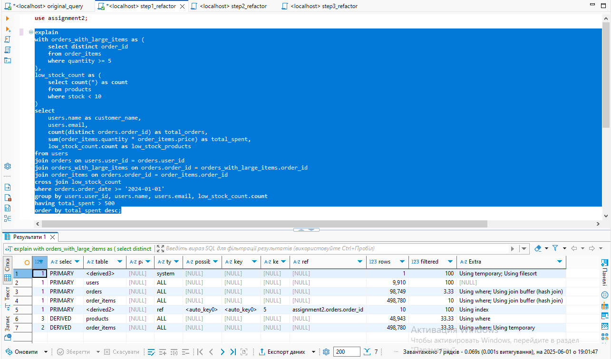

# explain and explain analyze

-> Sort: total_spent DESC  (actual time=2675..2676 rows=9502 loops=1)
    -> Filter: (total_spent > 500)  (actual time=2489..2663 rows=9502 loops=1)
        -> Stream results  (actual time=2489..2661 rows=9505 loops=1)
            -> Group aggregate: count(distinct orders.order_id), sum(tmp_field)  (actual time=2489..2654 rows=9505 loops=1)
                -> Sort: u.user_id, u.`name`, u.email  (actual time=2489..2517 rows=166254 loops=1)
                    -> Stream results  (cost=9.01e+15 rows=9.01e+15) (actual time=1006..2203 rows=166254 loops=1)
                        -> Inner hash join (oi.order_id = o.order_id)  (cost=9.01e+15 rows=9.01e+15) (actual time=1006..2074 rows=166254 loops=1)
                            -> Table scan on oi  (cost=1.24 rows=498780) (actual time=0.0441..598 rows=500011 loops=1)
                            -> Hash
                                -> Nested loop inner join  (cost=18.1e+9 rows=181e+9) (actual time=662..903 rows=29735 loops=1)
                                    -> Inner hash join (o.user_id = u.user_id)  (cost=3.47e+6 rows=1.09e+6) (actual time=25.5..216 rows=47108 loops=1)
                                        -> Filter: ((o.order_date >= DATE'2024-01-01') and (o.order_id is not null))  (cost=21.2 rows=3291) (actual time=0.0373..144 rows=47059 loops=1)
                                            -> Table scan on o  (cost=21.2 rows=98749) (actual time=0.0328..121 rows=100009 loops=1)
                                        -> Hash
                                            -> Table scan on u  (cost=1015 rows=9910) (actual time=0.042..15.4 rows=10008 loops=1)
                                    -> Single-row index lookup on <subquery3> using <auto_distinct_key> (order_id=o.order_id)  (cost=66895..66895 rows=1) (actual time=0.0144..0.0144 rows=0.631 loops=47108)
                                        -> Materialize with deduplication  (cost=66895..66895 rows=166243) (actual time=637..637 rows=62961 loops=1)
                                            -> Filter: (order_items.order_id is not null)  (cost=50271 rows=166243) (actual time=0.017..567 rows=99546 loops=1)
                                                -> Filter: (order_items.quantity >= 5)  (cost=50271 rows=166243) (actual time=0.0162..556 rows=99546 loops=1)
                                                    -> Table scan on order_items  (cost=50271 rows=498780) (actual time=0.0115..485 rows=500011 loops=1)
-> Select #2 (subquery in projection; run only once)
    -> Aggregate: count(0)  (cost=6582 rows=1) (actual time=47.9..47.9 rows=1 loops=1)
        -> Filter: (p.stock < 10)  (cost=4951 rows=16313) (actual time=0.0458..47.8 rows=526 loops=1)
            -> Table scan on p  (cost=4951 rows=48943) (actual time=0.0438..41.6 rows=50010 loops=1)

-> Sort: total_spent DESC  (actual time=3253..3255 rows=9502 loops=1)
    -> Filter: (total_spent > 500)  (actual time=3067..3241 rows=9502 loops=1)
        -> Stream results  (actual time=3067..3239 rows=9505 loops=1)
            -> Group aggregate: count(distinct orders.order_id), sum(tmp_field)  (actual time=3067..3231 rows=9505 loops=1)
                -> Sort: users.user_id, users.`name`, users.email  (actual time=3067..3095 rows=166254 loops=1)
                    -> Stream results  (cost=906e+12 rows=9.01e+15) (actual time=983..2757 rows=166254 loops=1)
                        -> Nested loop inner join  (cost=906e+12 rows=9.01e+15) (actual time=983..2587 rows=166254 loops=1)
                            -> Inner hash join (order_items.order_id = orders.order_id)  (cost=54.3e+9 rows=54.2e+9) (actual time=303..1450 rows=235899 loops=1)
                                -> Table scan on order_items  (cost=1.23 rows=498780) (actual time=0.043..630 rows=500011 loops=1)
                                -> Hash
                                    -> Inner hash join (orders.user_id = users.user_id)  (cost=3.47e+6 rows=1.09e+6) (actual time=24.5..211 rows=47108 loops=1)
                                        -> Filter: ((orders.order_date >= DATE'2024-01-01') and (orders.order_id is not null))  (cost=21.2 rows=3291) (actual time=0.0434..140 rows=47059 loops=1)
                                            -> Table scan on orders  (cost=21.2 rows=98749) (actual time=0.0383..118 rows=100009 loops=1)
                                        -> Hash
                                            -> Table scan on users  (cost=1015 rows=9910) (actual time=0.0351..15.6 rows=10008 loops=1)
                            -> Covering index lookup on orders_with_large_items using <auto_key0> (order_id=orders.order_id)  (cost=85600..85603 rows=10) (actual time=0.00435..0.00455 rows=0.705 loops=235899)
                                -> Materialize CTE orders_with_large_items  (cost=85600..85600 rows=166243) (actual time=680..680 rows=62961 loops=1)
                                    -> Table scan on <temporary>  (cost=66895..68976 rows=166243) (actual time=612..618 rows=62961 loops=1)
                                        -> Temporary table with deduplication  (cost=66895..66895 rows=166243) (actual time=611..611 rows=62961 loops=1)
                                            -> Filter: (order_items.quantity >= 5)  (cost=50271 rows=166243) (actual time=0.0198..542 rows=99546 loops=1)
                                                -> Table scan on order_items  (cost=50271 rows=498780) (actual time=0.0118..473 rows=500011 loops=1)

-> Sort: total_spent DESC  (actual time=3063..3064 rows=9502 loops=1)
    -> Filter: (total_spent > 500)  (actual time=2873..3050 rows=9502 loops=1)
        -> Stream results  (actual time=2873..3048 rows=9505 loops=1)
            -> Group aggregate: count(distinct orders.order_id), sum(tmp_field)  (actual time=2873..3040 rows=9505 loops=1)
                -> Sort: users.user_id, users.`name`, users.email  (actual time=2873..2901 rows=166254 loops=1)
                    -> Stream results  (cost=193029 rows=276418) (actual time=734..2540 rows=166254 loops=1)
                        -> Nested loop inner join  (cost=193029 rows=276418) (actual time=734..2300 rows=166254 loops=1)
                            -> Nested loop inner join  (cost=96283 rows=55409) (actual time=734..1410 rows=29735 loops=1)
                                -> Nested loop inner join  (cost=76890 rows=55409) (actual time=734..1222 rows=29706 loops=1)
                                    -> Filter: (orders_with_large_items.order_id is not null)  (cost=76893..18705 rows=166243) (actual time=734..757 rows=62961 loops=1)
                                        -> Table scan on orders_with_large_items  (cost=76894..78146 rows=99982) (actual time=734..747 rows=62961 loops=1)
                                            -> Materialize CTE orders_with_large_items  (cost=76894..76894 rows=99982) (actual time=734..734 rows=62961 loops=1)
                                                -> Group (no aggregates)  (cost=66895 rows=99982) (actual time=0.445..718 rows=62961 loops=1)
                                                    -> Filter: (order_items.quantity >= 5)  (cost=50271 rows=166243) (actual time=0.434..701 rows=99546 loops=1)
                                                        -> Covering index scan on order_items using index_order_items_order_id_quantity  (cost=50271 rows=498780) (actual time=0.419..625 rows=500011 loops=1)
                                    -> Filter: ((orders.order_date >= DATE'2024-01-01') and (orders.user_id is not null))  (cost=0.25 rows=0.333) (actual time=0.00651..0.00714 rows=0.472 loops=62961)
                                        -> Index lookup on orders using index_orders_order_id (order_id=orders_with_large_items.order_id)  (cost=0.25 rows=1) (actual time=0.00514..0.00652 rows=1 loops=62961)
                                -> Index lookup on users using index_users_user_id (user_id=orders.user_id)  (cost=0.25 rows=1) (actual time=0.00498..0.00609 rows=1 loops=29706)
                            -> Index lookup on order_items using index_order_items_order_id_quantity (order_id=orders_with_large_items.order_id)  (cost=1.25 rows=4.99) (actual time=0.00757..0.029 rows=5.59 loops=29735)

-> Sort: total_spent DESC  (actual time=3703..3705 rows=9502 loops=1)
    -> Filter: (total_spent > 500)  (actual time=3651..3691 rows=9502 loops=1)
        -> Stream results  (actual time=3651..3689 rows=9505 loops=1)
            -> Group aggregate: count(distinct orders.order_id), sum(order_totals.order_total)  (actual time=3651..3682 rows=9505 loops=1)
                -> Sort: users.user_id, users.`name`, users.email  (actual time=3651..3656 rows=29735 loops=1)
                    -> Stream results  (cost=554e+6 rows=5.54e+9) (actual time=2922..3589 rows=29735 loops=1)
                        -> Nested loop inner join  (cost=554e+6 rows=5.54e+9) (actual time=2922..3566 rows=29735 loops=1)
                            -> Nested loop inner join  (cost=96283 rows=55409) (actual time=606..1178 rows=29735 loops=1)
                                -> Nested loop inner join  (cost=76890 rows=55409) (actual time=606..996 rows=29706 loops=1)
                                    -> Filter: (orders_with_large_items.order_id is not null)  (cost=76893..18705 rows=166243) (actual time=606..625 rows=62961 loops=1)
                                        -> Table scan on orders_with_large_items  (cost=76894..78146 rows=99982) (actual time=606..617 rows=62961 loops=1)
                                            -> Materialize CTE orders_with_large_items  (cost=76894..76894 rows=99982) (actual time=606..606 rows=62961 loops=1)
                                                -> Group (no aggregates)  (cost=66895 rows=99982) (actual time=0.0324..591 rows=62961 loops=1)
                                                    -> Filter: (order_items.quantity >= 5)  (cost=50271 rows=166243) (actual time=0.027..573 rows=99546 loops=1)
                                                        -> Covering index scan on order_items using index_order_items_order_id_quantity  (cost=50271 rows=498780) (actual time=0.02..500 rows=500011 loops=1)
                                    -> Filter: ((orders.order_date >= DATE'2024-01-01') and (orders.user_id is not null))  (cost=0.25 rows=0.333) (actual time=0.00517..0.00568 rows=0.472 loops=62961)
                                        -> Index lookup on orders using index_orders_order_id (order_id=orders_with_large_items.order_id)  (cost=0.25 rows=1) (actual time=0.00406..0.00517 rows=1 loops=62961)
                                -> Index lookup on users using index_users_user_id (user_id=orders.user_id)  (cost=0.25 rows=1) (actual time=0.00424..0.00586 rows=1 loops=29706)
                            -> Index lookup on order_totals using <auto_key0> (order_id=orders_with_large_items.order_id)  (cost=110147..110150 rows=10) (actual time=0.0796..0.0799 rows=1 loops=29735)
                                -> Materialize CTE order_totals  (cost=110147..110147 rows=99982) (actual time=2316..2316 rows=99329 loops=1)
                                    -> Group aggregate: sum((order_items.quantity * order_items.price))  (cost=100149 rows=99982) (actual time=1.28..2113 rows=99329 loops=1)
                                        -> Index scan on order_items using index_order_items_order_id  (cost=50271 rows=498780) (actual time=1.24..1866 rows=500011 loops=1)

