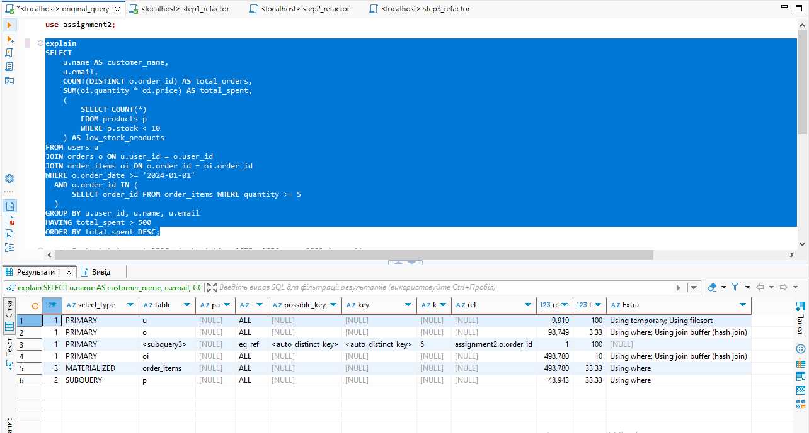
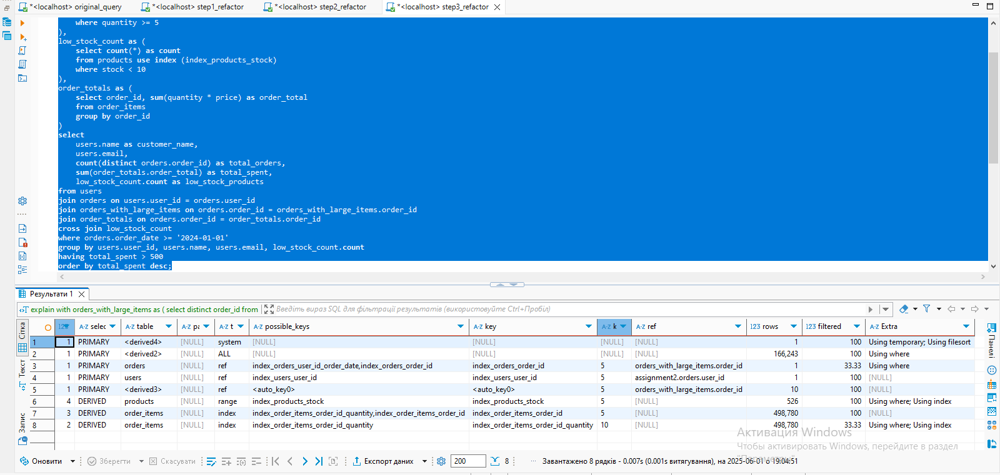

# explain and explain analyze

-> Sort: total_spent DESC  (actual time=0.574..0.574 rows=1 loops=1)
    -> Filter: (total_spent > 500)  (actual time=0.543..0.556 rows=1 loops=1)
        -> Stream results  (actual time=0.54..0.551 rows=3 loops=1)
            -> Group aggregate: count(distinct orders.order_id), sum(tmp_field)  (actual time=0.531..0.538 rows=3 loops=1)
                -> Sort: u.user_id, u.`name`, u.email  (actual time=0.507..0.509 rows=4 loops=1)
                    -> Stream results  (cost=2.68 rows=0.3) (actual time=0.407..0.464 rows=4 loops=1)
                        -> Inner hash join (oi.order_id = o.order_id)  (cost=2.68 rows=0.3) (actual time=0.384..0.429 rows=4 loops=1)
                            -> Table scan on oi  (cost=0.121 rows=11) (actual time=0.0175..0.0531 rows=11 loops=1)
                            -> Hash
                                -> Inner hash join (u.user_id = o.user_id)  (cost=2.12 rows=0.273) (actual time=0.274..0.321 rows=3 loops=1)
                                    -> Table scan on u  (cost=0.117 rows=8) (actual time=0.0232..0.0603 rows=8 loops=1)
                                    -> Hash
                                        -> Hash semijoin (order_items.order_id = o.order_id)  (cost=1.66 rows=0.273) (actual time=0.165..0.219 rows=3 loops=1)
                                            -> Filter: (o.order_date >= DATE'2024-01-01')  (cost=1.15 rows=3) (actual time=0.0189..0.0642 rows=9 loops=1)
                                                -> Table scan on o  (cost=1.15 rows=9) (actual time=0.0156..0.0537 rows=9 loops=1)
                                            -> Hash
                                                -> Filter: (order_items.quantity >= 5)  (cost=0.364 rows=1) (actual time=0.0789..0.106 rows=3 loops=1)
                                                    -> Table scan on order_items  (cost=0.364 rows=11) (actual time=0.063..0.0984 rows=11 loops=1)
-> Select #2 (subquery in projection; run only once)
    -> Aggregate: count(0)  (cost=1.58 rows=1) (actual time=0.0522..0.0523 rows=1 loops=1)
        -> Filter: (p.stock < 10)  (cost=1.25 rows=3.33) (actual time=0.0187..0.0483 rows=6 loops=1)
            -> Table scan on p  (cost=1.25 rows=10) (actual time=0.0171..0.0429 rows=10 loops=1)

-> Sort: total_spent DESC  (actual time=1.02..1.02 rows=1 loops=1)
    -> Filter: (total_spent > 500)  (actual time=0.824..0.842 rows=1 loops=1)
        -> Stream results  (actual time=0.821..0.836 rows=3 loops=1)
            -> Group aggregate: count(distinct orders.order_id), sum(tmp_field)  (actual time=0.813..0.822 rows=3 loops=1)
                -> Sort: users.user_id, users.`name`, users.email  (actual time=0.791..0.792 rows=4 loops=1)
                    -> Stream results  (cost=10.2 rows=12.1) (actual time=0.543..0.664 rows=4 loops=1)
                        -> Nested loop inner join  (cost=10.2 rows=12.1) (actual time=0.532..0.639 rows=4 loops=1)
                            -> Inner hash join (order_items.order_id = orders.order_id)  (cost=7.35 rows=3.3) (actual time=0.409..0.48 rows=11 loops=1)
                                -> Table scan on order_items  (cost=0.121 rows=11) (actual time=0.0296..0.0832 rows=11 loops=1)
                                -> Hash
                                    -> Inner hash join (users.user_id = orders.user_id)  (cost=3.8 rows=3) (actual time=0.229..0.271 rows=9 loops=1)
                                        -> Table scan on users  (cost=0.117 rows=8) (actual time=0.0188..0.0504 rows=8 loops=1)
                                        -> Hash
                                            -> Filter: ((orders.order_date >= DATE'2024-01-01') and (orders.order_id is not null))  (cost=1.15 rows=3) (actual time=0.0394..0.0856 rows=9 loops=1)
                                                -> Table scan on orders  (cost=1.15 rows=9) (actual time=0.0361..0.0742 rows=9 loops=1)
                            -> Covering index lookup on orders_with_large_items using <auto_key0> (order_id=orders.order_id)  (cost=4.9..5.18 rows=2) (actual time=0.0129..0.0133 rows=0.364 loops=11)
                                -> Materialize CTE orders_with_large_items  (cost=4.62..4.62 rows=3.67) (actual time=0.114..0.114 rows=3 loops=1)
                                    -> Table scan on <temporary>  (cost=2.41..4.25 rows=3.67) (actual time=0.0889..0.09 rows=3 loops=1)
                                        -> Temporary table with deduplication  (cost=1.72..1.72 rows=3.67) (actual time=0.0873..0.0873 rows=3 loops=1)
                                            -> Filter: (order_items.quantity >= 5)  (cost=1.35 rows=3.67) (actual time=0.0214..0.0525 rows=3 loops=1)
                                                -> Table scan on order_items  (cost=1.35 rows=11) (actual time=0.0152..0.0468 rows=11 loops=1)

-> Sort: total_spent DESC  (actual time=0.374..0.374 rows=1 loops=1)
    -> Filter: (total_spent > 500)  (actual time=0.327..0.34 rows=1 loops=1)
        -> Stream results  (actual time=0.325..0.336 rows=3 loops=1)
            -> Group aggregate: count(distinct orders.order_id), sum(tmp_field)  (actual time=0.319..0.326 rows=3 loops=1)
                -> Sort: users.user_id, users.`name`, users.email  (actual time=0.304..0.306 rows=4 loops=1)
                    -> Stream results  (cost=4.67 rows=1.22) (actual time=0.175..0.273 rows=4 loops=1)
                        -> Nested loop inner join  (cost=4.67 rows=1.22) (actual time=0.167..0.254 rows=4 loops=1)
                            -> Nested loop inner join  (cost=4.24 rows=1) (actual time=0.152..0.204 rows=3 loops=1)
                                -> Nested loop inner join  (cost=3.89 rows=1) (actual time=0.133..0.162 rows=3 loops=1)
                                    -> Filter: (orders_with_large_items.order_id is not null)  (cost=2.22..2.84 rows=3) (actual time=0.102..0.105 rows=3 loops=1)
                                        -> Table scan on orders_with_large_items  (cost=3.22..4.42 rows=1.91) (actual time=0.101..0.103 rows=3 loops=1)
                                            -> Materialize CTE orders_with_large_items  (cost=1.91..1.91 rows=1.91) (actual time=0.0999..0.0999 rows=3 loops=1)
                                                -> Group (no aggregates)  (cost=1.72 rows=1.91) (actual time=0.0552..0.0749 rows=3 loops=1)
                                                    -> Filter: (order_items.quantity >= 5)  (cost=1.35 rows=3.67) (actual time=0.0453..0.0713 rows=3 loops=1)
                                                        -> Covering index scan on order_items using idx_order_items_order_id_quantity  (cost=1.35 rows=11) (actual time=0.0371..0.066 rows=11 loops=1)
                                    -> Filter: ((orders.order_date >= DATE'2024-01-01') and (orders.user_id is not null))  (cost=0.261 rows=0.333) (actual time=0.0163..0.0186 rows=1 loops=3)
                                        -> Index lookup on orders using idx_orders_order_id (order_id=orders_with_large_items.order_id)  (cost=0.261 rows=1) (actual time=0.0147..0.0168 rows=1 loops=3)
                                -> Index lookup on users using idx_users_user_id (user_id=orders.user_id)  (cost=0.35 rows=1) (actual time=0.011..0.0132 rows=1 loops=3)
                            -> Index lookup on order_items using idx_order_items_order_id_quantity (order_id=orders_with_large_items.order_id)  (cost=0.428 rows=1.22) (actual time=0.0095..0.0157 rows=1.33 loops=3)

-> Sort: total_spent DESC  (actual time=0.55..0.55 rows=1 loops=1)
    -> Filter: (total_spent > 500)  (actual time=0.509..0.524 rows=1 loops=1)
        -> Stream results  (actual time=0.507..0.52 rows=3 loops=1)
            -> Group aggregate: count(distinct orders.order_id), sum(order_totals.order_total)  (actual time=0.501..0.508 rows=3 loops=1)
                -> Sort: users.user_id, users.`name`, users.email  (actual time=0.487..0.488 rows=3 loops=1)
                    -> Stream results  (cost=5.64 rows=9) (actual time=0.353..0.44 rows=3 loops=1)
                        -> Nested loop inner join  (cost=5.64 rows=9) (actual time=0.345..0.426 rows=3 loops=1)
                            -> Nested loop inner join  (cost=4.24 rows=1) (actual time=0.177..0.247 rows=3 loops=1)
                                -> Nested loop inner join  (cost=3.89 rows=1) (actual time=0.154..0.192 rows=3 loops=1)
                                    -> Filter: (orders_with_large_items.order_id is not null)  (cost=2.22..2.84 rows=3) (actual time=0.118..0.121 rows=3 loops=1)
                                        -> Table scan on orders_with_large_items  (cost=3.22..4.42 rows=1.91) (actual time=0.117..0.12 rows=3 loops=1)
                                            -> Materialize CTE orders_with_large_items  (cost=1.91..1.91 rows=1.91) (actual time=0.116..0.116 rows=3 loops=1)
                                                -> Group (no aggregates)  (cost=1.72 rows=1.91) (actual time=0.0776..0.0964 rows=3 loops=1)
                                                    -> Filter: (order_items.quantity >= 5)  (cost=1.35 rows=3.67) (actual time=0.0653..0.0915 rows=3 loops=1)
                                                        -> Covering index scan on order_items using idx_order_items_order_id_quantity  (cost=1.35 rows=11) (actual time=0.0561..0.0854 rows=11 loops=1)
                                    -> Filter: ((orders.order_date >= DATE'2024-01-01') and (orders.user_id is not null))  (cost=0.261 rows=0.333) (actual time=0.0198..0.0226 rows=1 loops=3)
                                        -> Index lookup on orders using idx_orders_order_id (order_id=orders_with_large_items.order_id)  (cost=0.261 rows=1) (actual time=0.018..0.0206 rows=1 loops=3)
                                -> Index lookup on users using idx_users_user_id (user_id=orders.user_id)  (cost=0.35 rows=1) (actual time=0.0134..0.0175 rows=1 loops=3)
                            -> Index lookup on order_totals using <auto_key0> (order_id=orders_with_large_items.order_id)  (cost=3.7..4.05 rows=2) (actual time=0.0574..0.0584 rows=1 loops=3)
                                -> Materialize CTE order_totals  (cost=3.35..3.35 rows=9) (actual time=0.163..0.163 rows=9 loops=1)
                                    -> Group aggregate: sum((order_items.quantity * order_items.price))  (cost=2.45 rows=9) (actual time=0.0527..0.127 rows=9 loops=1)
                                        -> Index scan on order_items using idx_order_items_order_id  (cost=1.35 rows=11) (actual time=0.0267..0.0995 rows=11 loops=1)

